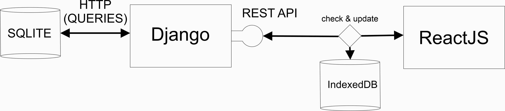
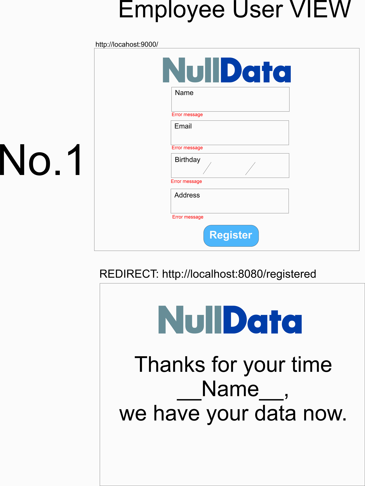

# Project 
I am not that experience with Laravel, I hope that it doesn’t disqualified me, 
because I used Django. 
  
* 

## VISION
* 
* 

## TODO
* Fields Authentication.
* Create a view for each employee where his personal information is shown.
* Translate their address to geographic coordinates using google maps, and save that information in the database.
* Create a superuser dashboard.
* The super admin should be capable to change employees information.
* Create a dashboard for employees (it should allow them to modify their information.).
* Implement indexDB to speed up response, and allow the user to have access to some records when the they lose internet connection.
